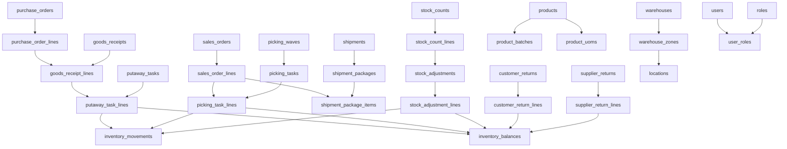

# Warehouse Management System - Detailed Business Flow Database Documentation

Dokumen ini menjelaskan secara detail table database apa saja yang digunakan dalam setiap business flow, beserta proses apa yang terjadi pada table tersebut, dan memastikan semua kolom terpakai.

---

## 📋 Table of Contents

1. [Flow 1: Inbound Process - Database Detail](#flow-1-inbound-process---database-detail)
2. [Flow 2: Outbound Process - Database Detail](#flow-2-outbound-process---database-detail)
3. [Flow 3: Inventory Management - Database Detail](#flow-3-inventory-management---database-detail)
4. [Flow 4: Returns Management - Database Detail](#flow-4-returns-management---database-detail)
5. [Master Data Tables Reference](#master-data-tables-reference)

---

## Flow 1: Inbound Process - Database Detail

Proses lengkap dari pembuatan Purchase Order hingga barang tersimpan di warehouse.

### 1.1 Purchase Order Creation

#### Tables Used:

**Table: `purchase_orders`**

| Column | Type | Usage in Process |
|--------|------|------------------|
| `id` | uint | Primary key, auto-generated |
| `po_number` | string | Generated unique PO number (e.g., PO-2024-0001) |
| `supplier_id` | uint | FK to suppliers table - identifies supplier |
| `warehouse_id` | uint | FK to warehouses table - destination warehouse |
| `status` | string | Lifecycle status: DRAFT → SUBMITTED → APPROVED/REJECTED → PARTIALLY_RECEIVED → RECEIVED → CLOSED |
| `order_date` | date | Date when PO is created |
| `expected_date` | date | Expected delivery date from supplier |
| `currency` | string | Currency code (e.g., IDR, USD) for pricing |
| `total_amount` | decimal | Total PO value, calculated from all lines |
| `created_by` | uint | FK to users table - user who created PO |
| `created_at` | timestamp | Auto-generated creation timestamp |
| `updated_at` | timestamp | Auto-updated on any change |

**Process Flow:**
1. **CREATE**: Insert new record with status='DRAFT', auto-generate `po_number`
2. **SUBMIT**: Update status='SUBMITTED' when buyer submits for approval
3. **APPROVE/REJECT**: Update status='APPROVED' or 'REJECTED' by manager
4. **RECEIVE**: Update status='PARTIALLY_RECEIVED' or 'RECEIVED' based on goods receipt
5. **CLOSE**: Update status='CLOSED' when PO is completed

---

**Table: `purchase_order_lines`**

| Column | Type | Usage in Process |
|--------|------|------------------|
| `id` | uint | Primary key, auto-generated |
| `purchase_order_id` | uint | FK to purchase_orders - parent PO |
| `line_no` | int | Line sequence number (1, 2, 3...) |
| `product_id` | uint | FK to products - product being ordered |
| `uom` | string | Unit of measure (e.g., PCS, KG, BOX) |
| `ordered_qty` | decimal | Quantity ordered from supplier |
| `received_qty` | decimal | Cumulative quantity received (updated from GR) |
| `unit_price` | decimal | Price per unit in PO currency |
| `tax_percent` | decimal | Tax percentage (e.g., 11.00 for 11% VAT) |
| `created_at` | timestamp | Auto-generated |
| `updated_at` | timestamp | Updated when received_qty changes |

**Process Flow:**
1. **CREATE**: Insert lines when adding products to PO
2. **UPDATE**: Increment `received_qty` when goods receipt is created
3. **VALIDATION**: Check if `received_qty` >= `ordered_qty` to determine PO completion

---

### 1.2 Goods Receipt Process

#### Tables Used:

**Table: `goods_receipts`**

| Column | Type | Usage in Process |
|--------|------|------------------|
| `id` | uint | Primary key |
| `gr_number` | string | Unique GR number (e.g., GR-2024-0001) |
| `purchase_order_id` | uint | FK to purchase_orders (nullable for non-PO receipts) |
| `warehouse_id` | uint | FK to warehouses - receiving warehouse |
| `supplier_id` | uint | FK to suppliers (nullable) |
| `status` | string | Status: DRAFT → IN_PROGRESS → COMPLETED |
| `received_at` | timestamp | Date/time when goods physically arrived |
| `received_by` | uint | FK to users - warehouse staff who received |
| `external_ref` | string | Supplier's delivery note number |

**Process Flow:**
1. **CREATE**: Insert new GR when supplier delivers, link to PO
2. **SCAN**: Update status='IN_PROGRESS' when staff starts receiving
3. **COMPLETE**: Update status='COMPLETED' when all items received

---

**Table: `goods_receipt_lines`**

| Column | Type | Usage in Process |
|--------|------|------------------|
| `id` | uint | Primary key |
| `goods_receipt_id` | uint | FK to goods_receipts |
| `purchase_order_line_id` | uint | FK to purchase_order_lines (nullable) |
| `line_no` | int | Line sequence number |
| `product_id` | uint | FK to products |
| `uom` | string | Unit of measure |
| `received_qty` | decimal | Actual quantity received |
| `batch_id` | uint | FK to product_batches (for batch-managed products) |
| `serial_number` | string | Serial number (for serialized products) |
| `qc_status` | string | Quality check result: PASS / FAIL / PENDING |
| `source_location_id` | uint | FK to locations - staging/receiving area |
| `note` | text | QC notes or damage description |
| `created_at` | timestamp | Auto-generated |

**Process Flow:**
1. **SCAN PRODUCT**: Insert line when staff scans product barcode
2. **ENTER QTY**: Set `received_qty` from staff input
3. **BATCH ENTRY**: If product is batch-managed, create/link `batch_id`
4. **QC CHECK**: Set `qc_status` = PASS/FAIL/PENDING
5. **LOCATION**: Set `source_location_id` to receiving dock location

---

**Table: `product_batches`**

| Column | Type | Usage in Process |
|--------|------|------------------|
| `id` | uint | Primary key |
| `product_id` | uint | FK to products |
| `batch_number` | string | Batch/lot number from supplier |
| `expiry_date` | date | Expiration date (for perishable goods) |
| `created_at` | timestamp | Auto-generated |
| `updated_at` | timestamp | Auto-updated |

**Process Flow:**
1. **CREATE**: Insert new batch if batch number doesn't exist
2. **LINK**: Reference batch_id in goods_receipt_lines

---

### 1.3 Putaway Process

#### Tables Used:

**Table: `putaway_tasks`**

| Column | Type | Usage in Process |
|--------|------|------------------|
| `id` | uint | Primary key |
| `warehouse_id` | uint | FK to warehouses |
| `goods_receipt_id` | uint | FK to goods_receipts - source GR |
| `assigned_to` | uint | FK to users - warehouse staff assigned |
| `status` | string | Status: PENDING → ASSIGNED → IN_PROGRESS → COMPLETED |
| `created_at` | timestamp | Auto-generated when task created |
| `updated_at` | timestamp | Updated on status changes |
| `started_at` | timestamp | Set when staff starts putaway |
| `completed_at` | timestamp | Set when all lines completed |

**Process Flow:**
1. **AUTO-CREATE**: System creates task when GR has QC_STATUS='PASS' items
2. **ASSIGN**: Set `assigned_to` and status='ASSIGNED'
3. **START**: Set `started_at` and status='IN_PROGRESS' when staff begins
4. **COMPLETE**: Set `completed_at` and status='COMPLETED' when done

---

**Table: `putaway_task_lines`**

| Column | Type | Usage in Process |
|--------|------|------------------|
| `id` | uint | Primary key |
| `putaway_task_id` | uint | FK to putaway_tasks |
| `goods_receipt_line_id` | uint | FK to goods_receipt_lines - source GR line |
| `product_id` | uint | FK to products |
| `source_location_id` | uint | FK to locations - receiving dock |
| `destination_location_id` | uint | FK to locations - storage location |
| `batch_id` | uint | FK to product_batches (if applicable) |
| `uom` | string | Unit of measure |
| `planned_qty` | decimal | Quantity to putaway |
| `putaway_qty` | decimal | Actual quantity putaway (updated during execution) |
| `created_at` | timestamp | Auto-generated |
| `updated_at` | timestamp | Updated when putaway_qty changes |

**Process Flow:**
1. **CREATE**: Insert lines for each GR line with QC_STATUS='PASS'
2. **SUGGEST LOCATION**: System suggests `destination_location_id` based on:
   - Product storage requirements
   - Available space
   - Zone optimization
3. **SCAN SOURCE**: Staff scans `source_location_id` to validate
4. **SCAN PRODUCT**: Staff scans product to validate
5. **SCAN/SELECT DEST**: Staff confirms or changes `destination_location_id`
6. **CONFIRM**: Update `putaway_qty` = `planned_qty`

---

### 1.4 Inventory Update Process

#### Tables Used:

**Table: `inventory_balances`**

| Column | Type | Usage in Process |
|--------|------|------------------|
| `id` | uint | Primary key |
| `warehouse_id` | uint | FK to warehouses |
| `location_id` | uint | FK to locations - specific storage location |
| `product_id` | uint | FK to products |
| `batch_id` | uint | FK to product_batches (nullable) |
| `status` | string | Stock status: AVAILABLE / RESERVED / QUARANTINE / DAMAGED |
| `on_hand_qty` | decimal | Physical quantity in location |
| `reserved_qty` | decimal | Quantity reserved for sales orders |
| `available_qty` | decimal | Calculated: on_hand_qty - reserved_qty |
| `created_at` | timestamp | Auto-generated |
| `updated_at` | timestamp | Updated on every qty change |

**Process Flow:**
1. **CHECK EXISTS**: Query if balance exists for (warehouse, location, product, batch, status)
2. **INSERT or UPDATE**:
   - If exists: `on_hand_qty` += `putaway_qty`
   - If not exists: Insert new record with `on_hand_qty` = `putaway_qty`
3. **CALCULATE**: `available_qty` = `on_hand_qty` - `reserved_qty`
4. **STATUS**: Set status='AVAILABLE' for good stock

---

**Table: `inventory_movements`**

| Column | Type | Usage in Process |
|--------|------|------------------|
| `id` | uint | Primary key - movement log |
| `movement_type` | string | Type: INBOUND / OUTBOUND / TRANSFER / ADJUSTMENT |
| `warehouse_id` | uint | FK to warehouses |
| `product_id` | uint | FK to products |
| `batch_id` | uint | FK to product_batches (nullable) |
| `from_location_id` | uint | FK to locations - source (nullable for INBOUND) |
| `to_location_id` | uint | FK to locations - destination (nullable for OUTBOUND) |
| `qty` | decimal | Quantity moved |
| `uom` | string | Unit of measure |
| `status_before` | string | Stock status before movement |
| `status_after` | string | Stock status after movement |
| `reference_type` | string | Source document type (e.g., 'PUTAWAY_TASK') |
| `reference_id` | uint | Source document ID |
| `created_at` | timestamp | Movement timestamp |
| `created_by` | uint | FK to users - who performed movement |
| `note` | text | Additional notes |

**Process Flow:**
1. **LOG MOVEMENT**: Insert record for audit trail
   - `movement_type` = 'INBOUND'
   - `from_location_id` = source (receiving dock)
   - `to_location_id` = destination (storage)
   - `qty` = putaway quantity
   - `reference_type` = 'PUTAWAY_TASK'
   - `reference_id` = putaway_task_id
2. **AUDIT**: Provides complete history of all inventory movements

---

## Flow 2: Outbound Process - Database Detail

Proses lengkap dari penerimaan Sales Order hingga pengiriman ke customer.

### 2.1 Sales Order Creation & Allocation

#### Tables Used:

**Table: `sales_orders`**

| Column | Type | Usage in Process |
|--------|------|------------------|
| `id` | uint | Primary key |
| `so_number` | string | Unique SO number (e.g., SO-2024-0001) |
| `external_ref` | string | Customer's PO number or order reference |
| `customer_id` | uint | FK to customers |
| `warehouse_id` | uint | FK to warehouses - fulfillment warehouse |
| `status` | string | Lifecycle: NEW → ALLOCATED/BACKORDER → PICKING → PICKED → PACKED → SHIPPED → DELIVERED → COMPLETED |
| `order_date` | timestamp | When customer placed order |
| `requested_ship_date` | date | Customer's requested delivery date |
| `priority` | string | Order priority: HIGH / MEDIUM / LOW |
| `shipping_address` | text | Full delivery address |
| `shipping_city` | string | Delivery city |
| `shipping_country` | string | Delivery country |
| `shipping_phone` | string | Contact phone for delivery |
| `created_at` | timestamp | Auto-generated |
| `updated_at` | timestamp | Auto-updated |

**Process Flow:**
1. **CREATE**: Insert new SO with status='NEW'
2. **ALLOCATE**: Update status='ALLOCATED' if stock available
3. **BACKORDER**: Update status='BACKORDER' if insufficient stock
4. **PICK**: Update status='PICKING' when picking starts
5. **PACK**: Update status='PACKED' when packing completes
6. **SHIP**: Update status='SHIPPED' when shipment created
7. **DELIVER**: Update status='DELIVERED' on delivery confirmation

---

**Table: `sales_order_lines`**

| Column | Type | Usage in Process |
|--------|------|------------------|
| `id` | uint | Primary key |
| `sales_order_id` | uint | FK to sales_orders |
| `line_no` | int | Line sequence number |
| `product_id` | uint | FK to products |
| `uom` | string | Unit of measure |
| `ordered_qty` | decimal | Quantity ordered by customer |
| `allocated_qty` | decimal | Quantity allocated from inventory |
| `shipped_qty` | decimal | Quantity actually shipped |
| `unit_price` | decimal | Selling price per unit |
| `created_at` | timestamp | Auto-generated |
| `updated_at` | timestamp | Updated when quantities change |

**Process Flow:**
1. **CREATE**: Insert lines when adding products to SO
2. **ALLOCATE**: Set `allocated_qty` when reserving inventory
3. **SHIP**: Set `shipped_qty` when items packed and shipped
4. **VALIDATION**: Check `shipped_qty` vs `ordered_qty` for completion

---

**Table: `inventory_balances` (Updated during allocation)**

| Column | Usage in Allocation |
|--------|---------------------|
| `reserved_qty` | Increment by allocated quantity |
| `available_qty` | Recalculate: on_hand_qty - reserved_qty |
| `updated_at` | Update timestamp |

**Process Flow:**
1. **CHECK AVAILABILITY**: Query `available_qty` >= `ordered_qty`
2. **RESERVE**: `reserved_qty` += `allocated_qty`
3. **UPDATE AVAILABLE**: `available_qty` = `on_hand_qty` - `reserved_qty`

---

### 2.2 Picking Wave & Task Creation

#### Tables Used:

**Table: `picking_waves`**

| Column | Type | Usage in Process |
|--------|------|------------------|
| `id` | uint | Primary key |
| `wave_number` | string | Unique wave number (e.g., WAVE-2024-0001) |
| `warehouse_id` | uint | FK to warehouses |
| `status` | string | Status: OPEN → RELEASED → IN_PROGRESS → COMPLETED |
| `created_at` | timestamp | Auto-generated |
| `updated_at` | timestamp | Auto-updated |
| `created_by` | uint | FK to users - who created wave |

**Process Flow:**
1. **CREATE**: Batch multiple SOs into one wave for efficiency
2. **RELEASE**: Update status='RELEASED' to make available for picking
3. **START**: Update status='IN_PROGRESS' when picking begins
4. **COMPLETE**: Update status='COMPLETED' when all tasks done

---

**Table: `picking_tasks`**

| Column | Type | Usage in Process |
|--------|------|------------------|
| `id` | uint | Primary key |
| `picking_wave_id` | uint | FK to picking_waves (nullable for single-order picks) |
| `sales_order_id` | uint | FK to sales_orders |
| `warehouse_id` | uint | FK to warehouses |
| `assigned_to` | uint | FK to users - picker assigned |
| `status` | string | Status: PENDING → ASSIGNED → IN_PROGRESS → COMPLETED |
| `created_at` | timestamp | Auto-generated |
| `updated_at` | timestamp | Auto-updated |
| `started_at` | timestamp | Set when picker starts |
| `completed_at` | timestamp | Set when all picks done |

**Process Flow:**
1. **CREATE**: Generate task for each SO in wave
2. **ASSIGN**: Set `assigned_to` and status='ASSIGNED'
3. **START**: Set `started_at` when picker begins
4. **COMPLETE**: Set `completed_at` when done

---

**Table: `picking_task_lines`**

| Column | Type | Usage in Process |
|--------|------|------------------|
| `id` | uint | Primary key |
| `picking_task_id` | uint | FK to picking_tasks |
| `sales_order_line_id` | uint | FK to sales_order_lines |
| `product_id` | uint | FK to products |
| `from_location_id` | uint | FK to locations - where to pick from |
| `batch_id` | uint | FK to product_batches (if applicable) |
| `uom` | string | Unit of measure |
| `planned_qty` | decimal | Quantity to pick |
| `picked_qty` | decimal | Actual quantity picked |
| `sequence_no` | int | Pick sequence for route optimization |
| `created_at` | timestamp | Auto-generated |
| `updated_at` | timestamp | Updated when picked_qty changes |

**Process Flow:**
1. **CREATE**: Generate lines based on SO lines and inventory allocation
2. **OPTIMIZE**: Set `sequence_no` for optimal picking route
3. **PICK**: Update `picked_qty` as picker scans items
4. **SHORT PICK**: If `picked_qty` < `planned_qty`, trigger replenishment alert

---

### 2.3 Inventory Update During Picking

**Table: `inventory_balances` (Updated during picking)**

| Column | Usage in Picking |
|--------|------------------|
| `on_hand_qty` | Decrement by picked quantity |
| `reserved_qty` | Decrement by picked quantity |
| `available_qty` | Recalculate (should remain same as both decrease) |
| `updated_at` | Update timestamp |

**Process Flow:**
1. **REDUCE ON-HAND**: `on_hand_qty` -= `picked_qty`
2. **REDUCE RESERVED**: `reserved_qty` -= `picked_qty`
3. **RECALCULATE**: `available_qty` = `on_hand_qty` - `reserved_qty`

---

**Table: `inventory_movements` (Log picking)**

**Process Flow:**
1. **LOG MOVEMENT**: Insert record
   - `movement_type` = 'OUTBOUND'
   - `from_location_id` = pick location
   - `to_location_id` = NULL (leaving warehouse)
   - `qty` = picked quantity
   - `reference_type` = 'PICKING_TASK'
   - `reference_id` = picking_task_id

---

### 2.4 Packing & Shipment Process

#### Tables Used:

**Table: `shipments`**

| Column | Type | Usage in Process |
|--------|------|------------------|
| `id` | uint | Primary key |
| `shipment_number` | string | Unique shipment number (e.g., SHIP-2024-0001) |
| `warehouse_id` | uint | FK to warehouses |
| `carrier_id` | uint | FK to carriers - shipping company |
| `status` | string | Status: READY → IN_TRANSIT → DELIVERED / FAILED |
| `dispatch_time` | timestamp | When carrier picked up |
| `delivered_time` | timestamp | When delivered to customer |
| `created_at` | timestamp | Auto-generated |

**Process Flow:**
1. **CREATE**: Insert shipment after packing
2. **ASSIGN CARRIER**: Set `carrier_id`
3. **DISPATCH**: Set `dispatch_time` and status='IN_TRANSIT'
4. **DELIVER**: Set `delivered_time` and status='DELIVERED'

---

**Table: `shipment_orders`**

| Column | Type | Usage in Process |
|--------|------|------------------|
| `id` | uint | Primary key |
| `shipment_id` | uint | FK to shipments |
| `sales_order_id` | uint | FK to sales_orders |

**Process Flow:**
1. **LINK**: Create record to link SO to shipment (many-to-many)
2. **BATCH**: Multiple SOs can be in one shipment

---

**Table: `shipment_packages`**

| Column | Type | Usage in Process |
|--------|------|------------------|
| `id` | uint | Primary key |
| `shipment_id` | uint | FK to shipments |
| `package_number` | string | Unique package number (e.g., PKG-2024-0001) |
| `tracking_number` | string | Carrier's tracking number |
| `weight` | decimal | Package weight in KG |
| `volume` | decimal | Package volume in cubic meters |
| `created_at` | timestamp | Auto-generated |
| `updated_at` | timestamp | Auto-updated |

**Process Flow:**
1. **CREATE**: Insert package during packing
2. **MEASURE**: Set `weight` and `volume` from packing station
3. **TRACK**: Set `tracking_number` from carrier system

---

**Table: `shipment_package_items`**

| Column | Type | Usage in Process |
|--------|------|------------------|
| `id` | uint | Primary key |
| `shipment_package_id` | uint | FK to shipment_packages |
| `sales_order_line_id` | uint | FK to sales_order_lines |
| `product_id` | uint | FK to products |
| `uom` | string | Unit of measure |
| `qty` | decimal | Quantity in this package |
| `created_at` | timestamp | Auto-generated |

**Process Flow:**
1. **PACK**: Insert items as packer scans into package
2. **VERIFY**: Validate against SO lines
3. **UPDATE SO**: Update `sales_order_lines.shipped_qty`

---

## Flow 3: Inventory Management - Database Detail

Proses pengelolaan stok, stock count, dan adjustment.

### 3.1 Stock Count (Cycle Count)

#### Tables Used:

**Table: `stock_counts`**

| Column | Type | Usage in Process |
|--------|------|------------------|
| `id` | uint | Primary key |
| `count_number` | string | Unique count number (e.g., COUNT-2024-0001) |
| `warehouse_id` | uint | FK to warehouses |
| `status` | string | Status: DRAFT → IN_PROGRESS → COMPLETED → POSTED |
| `count_type` | string | Type: FULL / CYCLE / PRODUCT / LOCATION |
| `scheduled_at` | timestamp | Planned count date/time |
| `completed_at` | timestamp | When counting finished |
| `created_by` | uint | FK to users - who created count |
| `created_at` | timestamp | Auto-generated |
| `updated_at` | timestamp | Auto-updated |

**Process Flow:**
1. **CREATE**: Insert count with status='DRAFT'
2. **GENERATE LINES**: Create count lines based on `count_type`
3. **START**: Update status='IN_PROGRESS' when counting begins
4. **COMPLETE**: Update status='COMPLETED', set `completed_at`
5. **POST**: Update status='POSTED' after variance approval

---

**Table: `stock_count_lines`**

| Column | Type | Usage in Process |
|--------|------|------------------|
| `id` | uint | Primary key |
| `stock_count_id` | uint | FK to stock_counts |
| `location_id` | uint | FK to locations |
| `product_id` | uint | FK to products |
| `batch_id` | uint | FK to product_batches (nullable) |
| `system_qty` | decimal | Quantity per system (from inventory_balances) |
| `counted_qty` | decimal | Physical count by staff |
| `variance_qty` | decimal | Calculated: counted_qty - system_qty |
| `created_at` | timestamp | Auto-generated |
| `updated_at` | timestamp | Updated when counted_qty entered |

**Process Flow:**
1. **GENERATE**: Insert lines with `system_qty` from inventory_balances
2. **COUNT**: Staff enters `counted_qty`
3. **CALCULATE**: `variance_qty` = `counted_qty` - `system_qty`
4. **REVIEW**: If |variance_qty| > threshold, require approval

---

### 3.2 Stock Adjustment

#### Tables Used:

**Table: `stock_adjustments`**

| Column | Type | Usage in Process |
|--------|------|------------------|
| `id` | uint | Primary key |
| `adjustment_number` | string | Unique number (e.g., ADJ-2024-0001) |
| `warehouse_id` | uint | FK to warehouses |
| `reason_code` | string | Reason: DAMAGE / EXPIRY / FOUND / LOST / COUNT_VARIANCE |
| `status` | string | Status: DRAFT → PENDING_APPROVAL → APPROVED / REJECTED → POSTED |
| `created_by` | uint | FK to users |
| `created_at` | timestamp | Auto-generated |
| `updated_at` | timestamp | Auto-updated |
| `posted_at` | timestamp | When adjustment posted to inventory |

**Process Flow:**
1. **CREATE**: Insert adjustment (manual or from stock count)
2. **SUBMIT**: Update status='PENDING_APPROVAL' if exceeds threshold
3. **APPROVE**: Update status='APPROVED' by manager
4. **POST**: Update status='POSTED', set `posted_at`, update inventory

---

**Table: `stock_adjustment_lines`**

| Column | Type | Usage in Process |
|--------|------|------------------|
| `id` | uint | Primary key |
| `stock_adjustment_id` | uint | FK to stock_adjustments |
| `location_id` | uint | FK to locations |
| `product_id` | uint | FK to products |
| `batch_id` | uint | FK to product_batches (nullable) |
| `qty_delta` | decimal | Quantity change (positive or negative) |
| `uom` | string | Unit of measure |
| `note` | text | Explanation for adjustment |
| `created_at` | timestamp | Auto-generated |
| `updated_at` | timestamp | Auto-updated |

**Process Flow:**
1. **CREATE**: Insert lines with `qty_delta` (+ for increase, - for decrease)
2. **POST**: Update inventory_balances.on_hand_qty += qty_delta
3. **LOG**: Create inventory_movement record

---

**Table: `inventory_balances` (Updated by adjustment)**

**Process Flow:**
1. **UPDATE**: `on_hand_qty` += `qty_delta`
2. **RECALCULATE**: `available_qty` = `on_hand_qty` - `reserved_qty`
3. **TIMESTAMP**: Update `updated_at`

---

**Table: `inventory_movements` (Log adjustment)**

**Process Flow:**
1. **LOG**: Insert movement record
   - `movement_type` = 'ADJUSTMENT'
   - `qty` = abs(qty_delta)
   - `reference_type` = 'STOCK_ADJUSTMENT'
   - `reference_id` = stock_adjustment_id

---

## Flow 4: Returns Management - Database Detail

### 4.1 Customer Return Process

#### Tables Used:

**Table: `customer_returns`**

| Column | Type | Usage in Process |
|--------|------|------------------|
| `id` | uint | Primary key |
| `return_number` | string | Unique RMA number (e.g., RMA-2024-0001) |
| `sales_order_id` | uint | FK to sales_orders - original order |
| `customer_id` | uint | FK to customers |
| `warehouse_id` | uint | FK to warehouses - return destination |
| `status` | string | Status: REQUESTED → APPROVED / REJECTED → RECEIVED → COMPLETED |
| `reason` | text | Customer's return reason |
| `requested_at` | timestamp | When customer requested return |
| `received_at` | timestamp | When warehouse received items |
| `created_at` | timestamp | Auto-generated |
| `updated_at` | timestamp | Auto-updated |

**Process Flow:**
1. **REQUEST**: Insert with status='REQUESTED'
2. **APPROVE**: Update status='APPROVED', generate RMA number
3. **RECEIVE**: Update status='RECEIVED', set `received_at`
4. **COMPLETE**: Update status='COMPLETED' after processing

---

**Table: `customer_return_lines`**

| Column | Type | Usage in Process |
|--------|------|------------------|
| `id` | uint | Primary key |
| `customer_return_id` | uint | FK to customer_returns |
| `sales_order_line_id` | uint | FK to sales_order_lines - original line |
| `product_id` | uint | FK to products |
| `uom` | string | Unit of measure |
| `returned_qty` | decimal | Quantity returned by customer |
| `qc_status` | string | Inspection result: GOOD / DAMAGED / DEFECTIVE |
| `return_reason_code` | string | Reason code: WRONG_ITEM / DAMAGED / DEFECTIVE / CHANGED_MIND |
| `created_at` | timestamp | Auto-generated |
| `updated_at` | timestamp | Auto-updated |

**Process Flow:**
1. **CREATE**: Insert lines for returned items
2. **INSPECT**: Set `qc_status` after physical inspection
3. **PROCESS**: Based on qc_status:
   - GOOD → Return to inventory
   - DAMAGED → Create disposal record
   - DEFECTIVE → Create supplier return

---

**Table: `inventory_balances` (Updated for GOOD returns)**

**Process Flow:**
1. **INCREASE**: `on_hand_qty` += `returned_qty` (if qc_status='GOOD')
2. **STATUS**: May set status='AVAILABLE' or 'QUARANTINE' based on policy
3. **RECALCULATE**: `available_qty` = `on_hand_qty` - `reserved_qty`

---

**Table: `inventory_movements` (Log return)**

**Process Flow:**
1. **LOG**: Insert movement
   - `movement_type` = 'INBOUND'
   - `to_location_id` = return location
   - `qty` = returned_qty
   - `reference_type` = 'CUSTOMER_RETURN'
   - `reference_id` = customer_return_id

---

### 4.2 Supplier Return Process

#### Tables Used:

**Table: `supplier_returns`**

| Column | Type | Usage in Process |
|--------|------|------------------|
| `id` | uint | Primary key |
| `return_number` | string | Unique number (e.g., SUPRET-2024-0001) |
| `supplier_id` | uint | FK to suppliers |
| `warehouse_id` | uint | FK to warehouses |
| `status` | string | Status: DRAFT → SUBMITTED → APPROVED / REJECTED → SHIPPED → COMPLETED |
| `reason` | text | Return reason (defective, damaged, etc.) |
| `created_at` | timestamp | Auto-generated |
| `updated_at` | timestamp | Auto-updated |
| `created_by` | uint | FK to users |

**Process Flow:**
1. **CREATE**: Insert with status='DRAFT'
2. **SUBMIT**: Update status='SUBMITTED' to supplier
3. **APPROVE**: Update status='APPROVED' by supplier
4. **SHIP**: Update status='SHIPPED' when sent
5. **COMPLETE**: Update status='COMPLETED' when credit received

---

**Table: `supplier_return_lines`**

| Column | Type | Usage in Process |
|--------|------|------------------|
| `id` | uint | Primary key |
| `supplier_return_id` | uint | FK to supplier_returns |
| `product_id` | uint | FK to products |
| `batch_id` | uint | FK to product_batches (nullable) |
| `uom` | string | Unit of measure |
| `qty` | decimal | Quantity being returned |
| `reason_code` | string | Specific reason: DEFECTIVE / DAMAGED / WRONG_ITEM |
| `created_at` | timestamp | Auto-generated |
| `updated_at` | timestamp | Auto-updated |

**Process Flow:**
1. **CREATE**: Insert lines for items to return
2. **VALIDATE**: Check against original GR if applicable
3. **SHIP**: Items packed and sent to supplier

---

**Table: `inventory_balances` (Updated when return shipped)**

**Process Flow:**
1. **DECREASE**: `on_hand_qty` -= `qty`
2. **RECALCULATE**: `available_qty` = `on_hand_qty` - `reserved_qty`

---

**Table: `inventory_movements` (Log supplier return)**

**Process Flow:**
1. **LOG**: Insert movement
   - `movement_type` = 'OUTBOUND'
   - `from_location_id` = quarantine/return location
   - `qty` = return qty
   - `reference_type` = 'SUPPLIER_RETURN'
   - `reference_id` = supplier_return_id

---

## Master Data Tables Reference

### User & Role Management

**Table: `users`**

| Column | Type | Usage |
|--------|------|-------|
| `id` | uint | Primary key |
| `username` | string | Login username |
| `email` | string | User email |
| `password_hash` | string | Encrypted password |
| `full_name` | string | Display name |
| `is_active` | bool | Account status |
| `created_at` | timestamp | Auto-generated |
| `updated_at` | timestamp | Auto-updated |

**Used in**: All tables with `created_by`, `assigned_to`, `received_by` fields

---

**Table: `roles`**

| Column | Type | Usage |
|--------|------|-------|
| `id` | uint | Primary key |
| `role_name` | string | Role name (e.g., ADMIN, WAREHOUSE_MANAGER, PICKER) |
| `description` | string | Role description |
| `permissions` | json | Permission array |
| `created_at` | timestamp | Auto-generated |
| `updated_at` | timestamp | Auto-updated |

**Used in**: Authorization and access control

---

**Table: `user_roles`**

| Column | Type | Usage |
|--------|------|-------|
| `id` | uint | Primary key |
| `user_id` | uint | FK to users |
| `role_id` | uint | FK to roles |

**Used in**: Many-to-many relationship between users and roles

---

### Warehouse & Location Management

**Table: `warehouses`**

| Column | Type | Usage |
|--------|------|-------|
| `id` | uint | Primary key |
| `warehouse_code` | string | Unique code (e.g., WH-001) |
| `warehouse_name` | string | Display name |
| `address` | text | Full address |
| `city` | string | City |
| `country` | string | Country |
| `postal_code` | string | Postal/ZIP code |
| `phone` | string | Contact phone |
| `email` | string | Contact email |
| `is_active` | bool | Operational status |
| `warehouse_type` | string | Type: MAIN / DISTRIBUTION / RETAIL |
| `total_capacity` | decimal | Total storage capacity |
| `used_capacity` | decimal | Currently used capacity |
| `created_at` | timestamp | Auto-generated |
| `updated_at` | timestamp | Auto-updated |

**Used in**: All transactional tables to identify warehouse

---

**Table: `warehouse_zones`**

| Column | Type | Usage |
|--------|------|-------|
| `id` | uint | Primary key |
| `warehouse_id` | uint | FK to warehouses |
| `zone_code` | string | Zone code (e.g., A, B, C) |
| `zone_name` | string | Zone name |
| `zone_type` | string | Type: RECEIVING / STORAGE / PICKING / SHIPPING / QUARANTINE |
| `created_at` | timestamp | Auto-generated |
| `updated_at` | timestamp | Auto-updated |

**Used in**: Location organization

---

**Table: `locations`**

| Column | Type | Usage |
|--------|------|-------|
| `id` | uint | Primary key |
| `warehouse_id` | uint | FK to warehouses |
| `zone_id` | uint | FK to warehouse_zones |
| `location_code` | string | Unique code (e.g., A-01-01-A) |
| `location_type` | string | Type: SHELF / PALLET / FLOOR / DOCK |
| `aisle` | string | Aisle identifier |
| `rack` | string | Rack identifier |
| `shelf` | string | Shelf identifier |
| `bin` | string | Bin identifier |
| `capacity` | decimal | Storage capacity |
| `is_active` | bool | Usable status |
| `is_pickable` | bool | Can pick from this location |
| `is_receivable` | bool | Can receive to this location |
| `created_at` | timestamp | Auto-generated |
| `updated_at` | timestamp | Auto-updated |

**Used in**: All inventory operations to specify exact location

---

### Product Management

**Table: `products`** (Already detailed above)

**Table: `product_uoms`**

| Column | Type | Usage |
|--------|------|-------|
| `id` | uint | Primary key |
| `product_id` | uint | FK to products |
| `uom` | string | Unit of measure (e.g., BOX, CARTON) |
| `conversion_factor` | decimal | Conversion to base UOM (e.g., 1 BOX = 12 PCS) |
| `is_base_uom` | bool | Is this the base UOM |
| `created_at` | timestamp | Auto-generated |
| `updated_at` | timestamp | Auto-updated |

**Used in**: UOM conversions in all transactions

---

### Partner Management

**Table: `suppliers`**

| Column | Type | Usage |
|--------|------|-------|
| `id` | uint | Primary key |
| `supplier_code` | string | Unique code |
| `supplier_name` | string | Company name |
| `contact_person` | string | Contact name |
| `email` | string | Email |
| `phone` | string | Phone |
| `address` | text | Full address |
| `city` | string | City |
| `country` | string | Country |
| `is_active` | bool | Active status |
| `created_at` | timestamp | Auto-generated |
| `updated_at` | timestamp | Auto-updated |

**Used in**: Purchase orders, goods receipts, supplier returns

---

**Table: `customers`**

| Column | Type | Usage |
|--------|------|-------|
| `id` | uint | Primary key |
| `customer_code` | string | Unique code |
| `customer_name` | string | Company/person name |
| `contact_person` | string | Contact name |
| `email` | string | Email |
| `phone` | string | Phone |
| `billing_address` | text | Billing address |
| `shipping_address` | text | Default shipping address |
| `city` | string | City |
| `country` | string | Country |
| `is_active` | bool | Active status |
| `created_at` | timestamp | Auto-generated |
| `updated_at` | timestamp | Auto-updated |

**Used in**: Sales orders, customer returns

---

**Table: `carriers`**

| Column | Type | Usage |
|--------|------|-------|
| `id` | uint | Primary key |
| `carrier_code` | string | Unique code |
| `carrier_name` | string | Company name (e.g., JNE, TIKI, DHL) |
| `contact_person` | string | Contact name |
| `phone` | string | Phone |
| `email` | string | Email |
| `is_active` | bool | Active status |
| `created_at` | timestamp | Auto-generated |
| `updated_at` | timestamp | Auto-updated |

**Used in**: Shipments for carrier assignment

---

## Summary: All Columns Usage Verification

### ✅ Columns Usage Coverage

Semua kolom dalam setiap table telah dijelaskan penggunaannya dalam business flow:

1. **Primary Keys (id)**: Auto-generated identifier untuk setiap record
2. **Foreign Keys**: Menghubungkan relasi antar table
3. **Business Keys**: Unique identifiers (po_number, so_number, etc.)
4. **Status Fields**: Melacak lifecycle state dari setiap dokumen
5. **Quantity Fields**: Menyimpan berbagai jenis quantity (ordered, received, picked, shipped, dll)
6. **Date/Time Fields**: Melacak timeline events (created_at, updated_at, started_at, completed_at)
7. **User References**: Audit trail (created_by, assigned_to, received_by)
8. **Descriptive Fields**: Additional information (notes, reasons, addresses)
9. **Calculated Fields**: Derived values (available_qty, variance_qty, total_amount)
10. **Configuration Fields**: Settings and flags (is_active, is_batch_managed, priority)

### 📊 Table Relationships Summary

---

**Dokumen ini memastikan:**
- ✅ Semua 37 table database terdokumentasi
- ✅ Semua kolom pada setiap table dijelaskan penggunaannya
- ✅ Setiap business flow dipetakan ke table dan kolom yang terlibat
- ✅ Proses CRUD (Create, Read, Update, Delete) pada setiap table dijelaskan
- ✅ Relasi antar table terdokumentasi dengan jelas
