# Warehouse Management System - Business Flow Documentation

Dokumentasi ini menjelaskan alur bisnis end-to-end dari Warehouse Management System, mulai dari procurement hingga delivery ke customer.

---

## 📋 Table of Contents

1. [Overview - Complete End-to-End Flow](#overview-complete-end-to-end-flow)
2. [Flow 1: Inbound Process (Procurement to Storage)](#flow-1-inbound-process)
3. [Flow 2: Outbound Process (Order to Delivery)](#flow-2-outbound-process)
4. [Flow 3: Inventory Management](#flow-3-inventory-management)
5. [Flow 4: Returns Management](#flow-4-returns-management)
6. [System Architecture Flow](#system-architecture-flow)

---

## Overview: Complete End-to-End Flow

Diagram ini menunjukkan gambaran besar seluruh proses warehouse dari procurement hingga delivery.

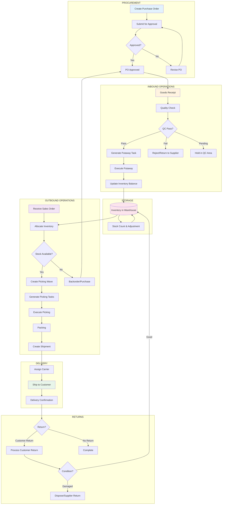

---

## Flow 1: Inbound Process

Proses lengkap dari pembuatan Purchase Order hingga barang tersimpan di warehouse.

### 1.1 Purchase Order Flow

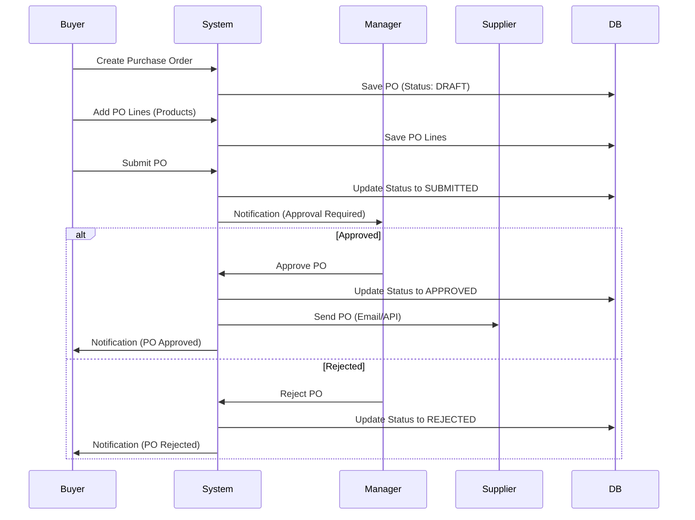

### 1.2 Goods Receipt & Putaway Flow

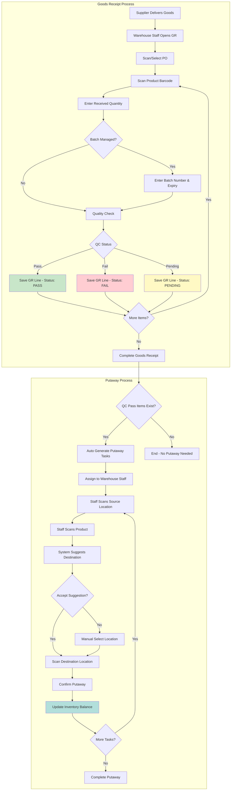

### 1.3 Inventory Update Flow

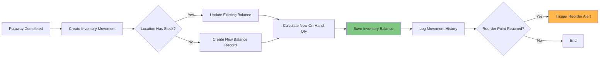

---

## Flow 2: Outbound Process

Proses lengkap dari penerimaan Sales Order hingga pengiriman ke customer.

### 2.1 Sales Order & Allocation Flow

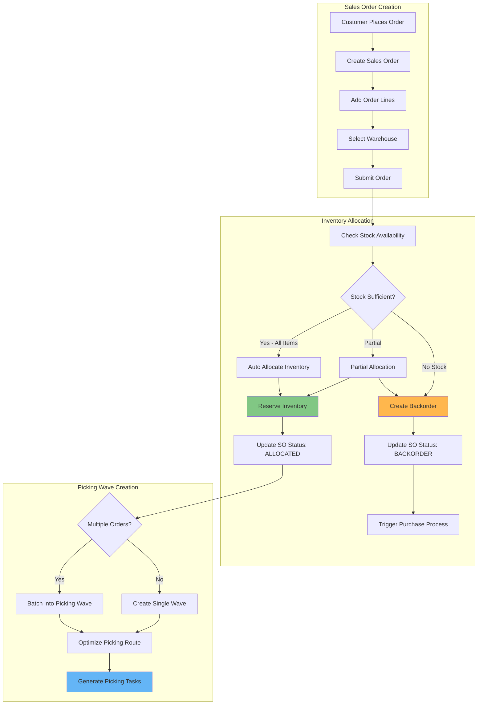

### 2.2 Picking & Packing Flow

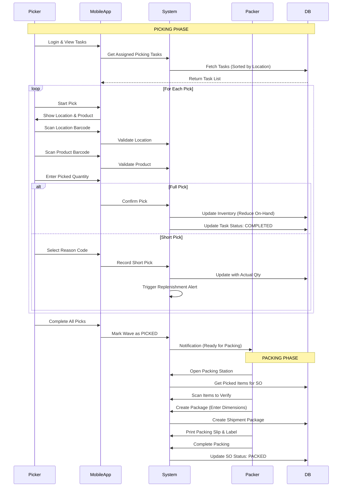

### 2.3 Shipment & Delivery Flow

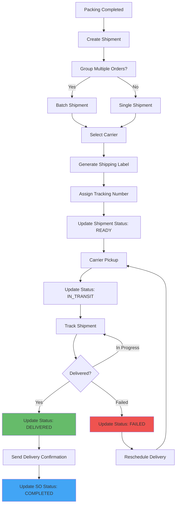

---

## Flow 3: Inventory Management

Proses pengelolaan stok, stock count, dan adjustment.

### 3.1 Stock Count (Cycle Count) Flow

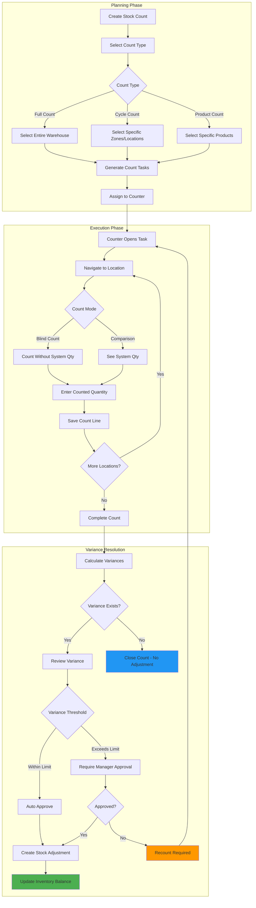

### 3.2 Stock Adjustment Flow

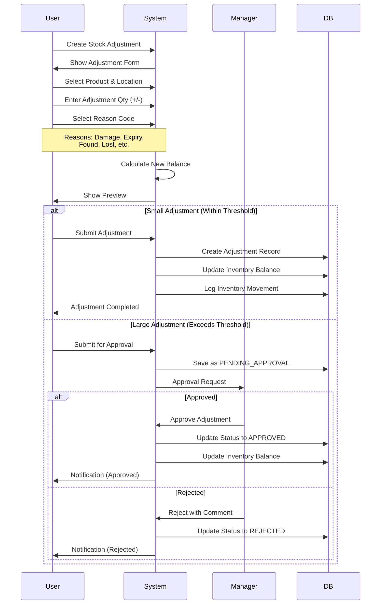

---

## Flow 4: Returns Management

Proses pengelolaan return dari customer dan return ke supplier.

### 4.1 Customer Return Flow

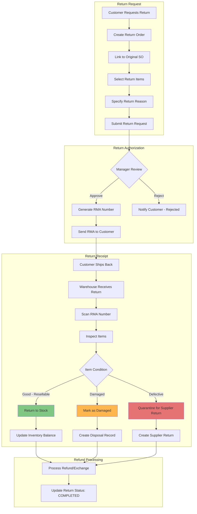

### 4.2 Supplier Return Flow

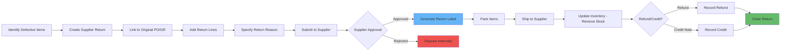

---

## System Architecture Flow

Diagram ini menunjukkan bagaimana data mengalir melalui sistem dari layer ke layer.

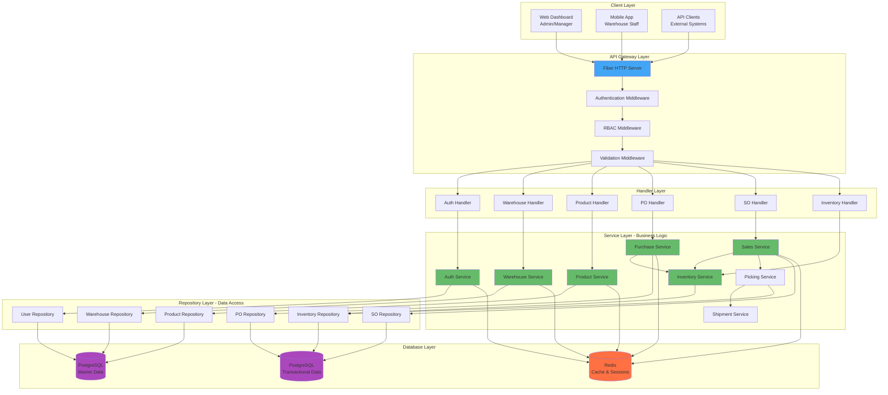

---

## Data Flow Examples

### Example 1: Complete Purchase Order to Stock Flow

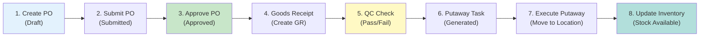

### Example 2: Complete Sales Order to Delivery Flow

```mermaid
graph LR
    A["1. Create SO<br/>(New Order)"] --> B["2. Allocate Stock<br/>(Reserved)"]
    B --> C["3. Create Wave<br/>(Batched)"]
    C --> D["4. Picking Task<br/>(Assigned)"]
    D --> E["5. Execute Pick<br/>(Picked)"]
    E --> F["6. Packing<br/>(Packed)"]
    F --> G["7. Create Shipment<br/>(Ready)"]
    G --> H["8. Dispatch<br/>(In Transit)"]
    H --> I["9. Delivery<br/>(Completed)"]
    
    style A fill:#f3e5f5
    style B fill:#fff9c4
    style E fill:#c8e6c9
    style I fill:#b2dfdb
```

---

## Status Transitions

### Purchase Order Status Flow

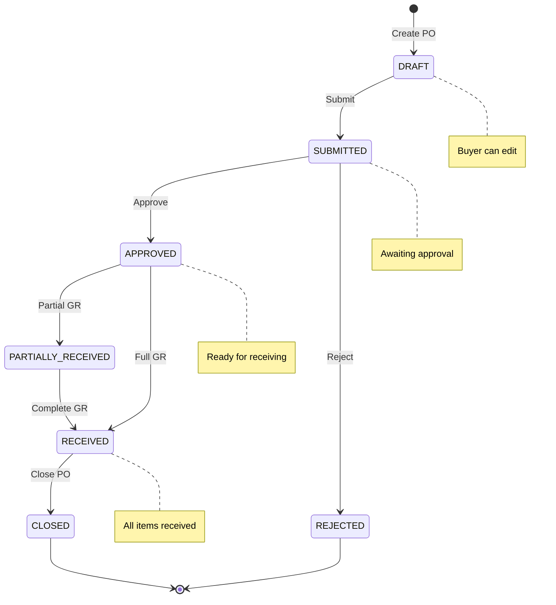

### Sales Order Status Flow

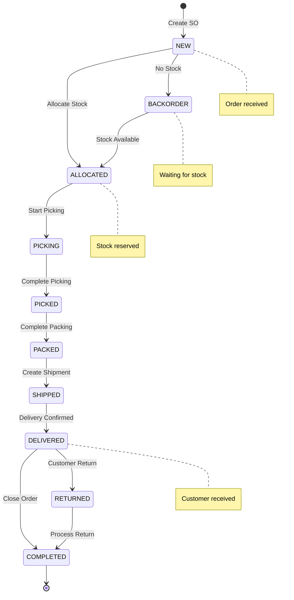

### Inventory Movement Types

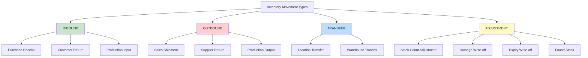

---

## Integration Points

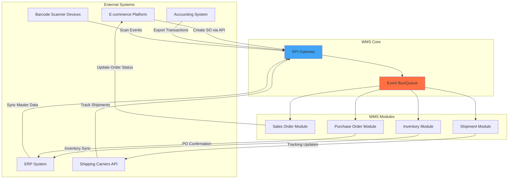

---

## Summary

Dokumentasi ini mencakup:

✅ **End-to-End Business Flow** - Dari procurement hingga delivery  
✅ **Inbound Process** - PO, Goods Receipt, Putaway  
✅ **Outbound Process** - Sales Order, Picking, Packing, Shipment  
✅ **Inventory Management** - Stock Count, Adjustments  
✅ **Returns Management** - Customer & Supplier Returns  
✅ **System Architecture** - Layer-by-layer data flow  
✅ **Status Transitions** - State diagrams untuk setiap entity  
✅ **Integration Points** - External system connections

Semua diagram dapat di-render di Markdown viewer yang support Mermaid (GitHub, GitLab, VS Code, dll).
